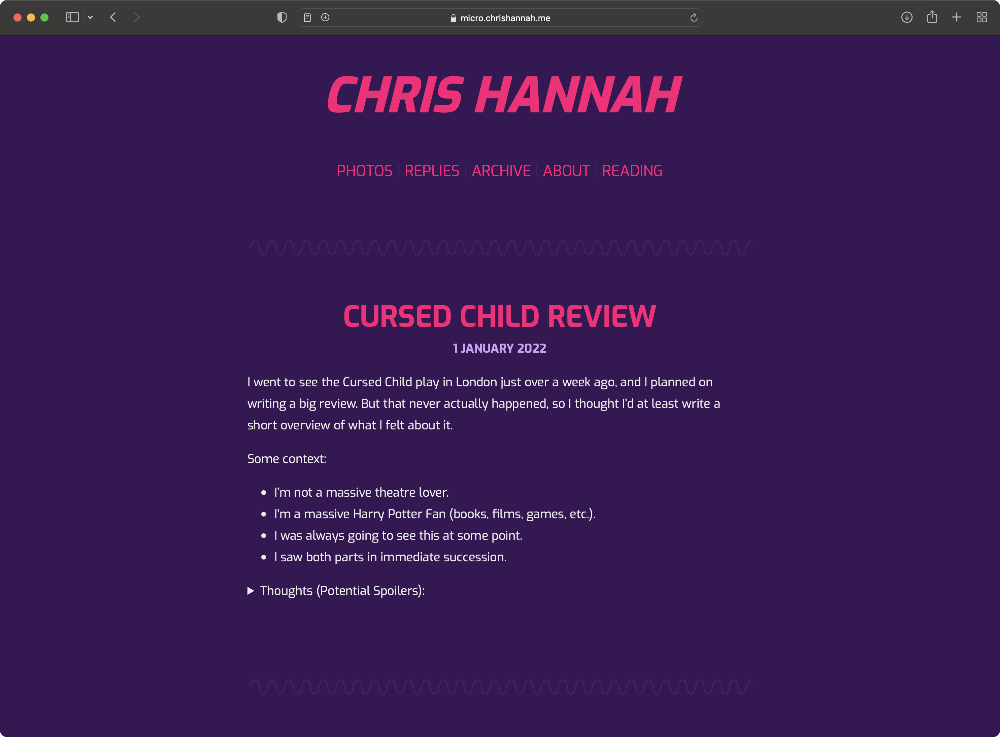
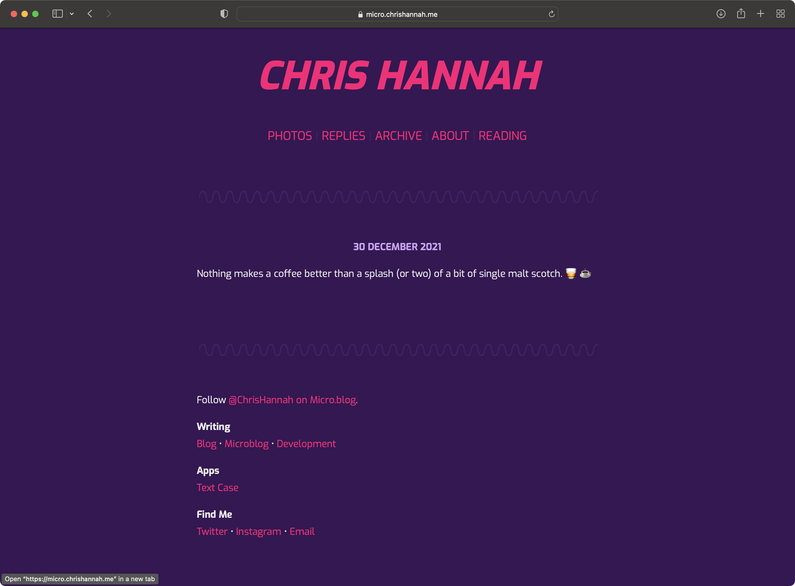
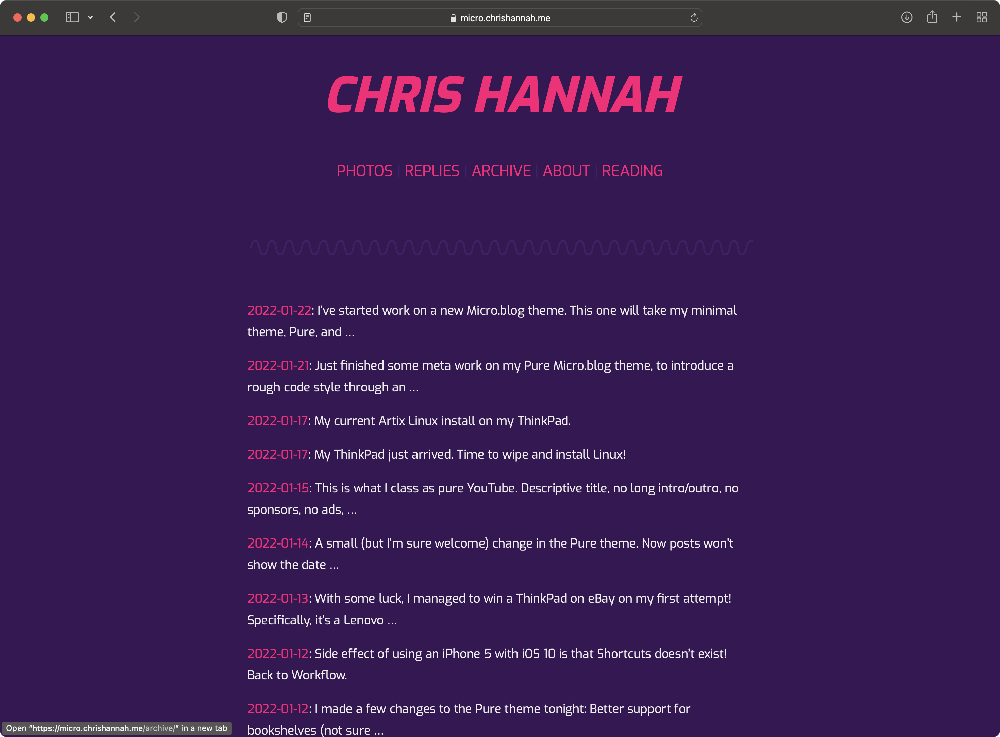

# Fortis

A theme for Micro.blog that stands out. Based on my minimal Micro.blog theme, [Pure](https://github.com/chrishannah/pure).

## Screenshots

## Code Style

This project makes use of the [Prettier](https://prettier.io) code formatter. This formatting will be done automatically in a GitHub Action, but most IDEs can be configured to run this locally.

There is also a second automated step which also runs as part of a GitHub Action, and that is [Super-Linter](https://github.com/github/super-linter). This runs the code through a whole host of linters, and will report any errors. Some configurations have been changed for this project, which can be found under `.github/linters`. The main change is that this project uses tabs instead of spaces.
